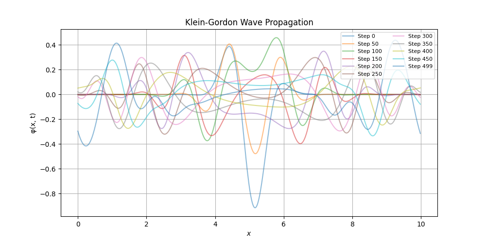

# klein-gordon-fdm
 
This is a C++ program which solves the 1-D Klein-Gordon equation using a finite difference leapfrog method to simulate the evolution of a scalar field on a spatial grid with Gaussian initial conditions and periodic boundary conditions. 

klein_gordon.cpp generates .dat files which contain position and field values which can be plotted using plotting_program to show spatial wave propagation through time.

heatmap_program.py displays the time evolution of the scalar field in the form of a heatmap. 

Physically, this simulation can represent a free scalar (spin-0) bosonic field, as well as classical wave propagation in relativistic systems. With mass set to 0.0 (m = 0) the Klein-Gordon equation reduces to the electromagnetic wave equation, which is shown by the non-oscillatory behavior shown in the plots for this case. 

