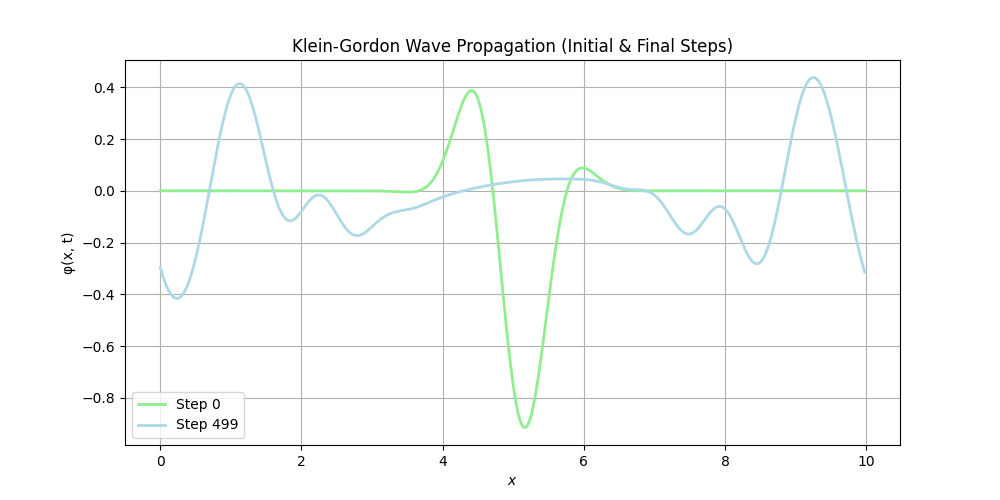

# klein-gordon-fdm
 
This is a C++ program which solves the 1-D Klein-Gordon equation using a finite difference leapfrog method to simulate the evolution of a scalar field with Gaussian initial conditions and periodic boundary conditions.

Physically, this simulation represents the evolution of a free scalar (spin-0) bosonic field. With mass set to 0.0 (m = 0) the Klein-Gordon equation reduces to the electromagnetic wave equation, which can shown by non-oscillatory behavior in plots for this case. 

klein_gordon.cpp generates .dat files which contain position and field values which can be plotted using plotting_program to show spatial wave propagation through time.

heatmap_program.py displays the time evolution of the scalar field in the form of a heatmap. 

